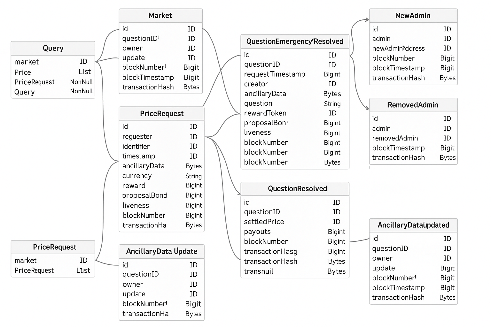

# 🎯 Polymarket Names Subgraph

**The first decentralized solution for extracting human-readable Polymarket market names directly from blockchain data.**

[](https://api.thegraph.com/subgraphs/id/QmP6hMoYTYx4dFGs2dYiNnUDsRZ4ybhH9N6C6G19tHQxku)
[]()
[]()

---

## 🚀 **Why This Matters**

**Before:** Developers had to rely on Polymarket's API to get human-readable market names
```json
// Raw subgraph data
{
  "conditionId": "0xe5107ae8640f781ba136c89c5be7934dbc5dd67ce10b95e10e8fa7e085cd7344",
  "question": "???"  // No human-readable name!
}
```

**After:** Get clean, human-readable names directly from blockchain data
```json
// With Polymarket Names Subgraph
{
  "questionID": "0xe5107ae8640f781ba136c89c5be7934dbc5dd67ce10b95e10e8fa7e085cd7344",
  "question": "LEC Finals: G2 vs. Movistar KOI - G2 and Movistar KOI are scheduled to play..."
}
```

## 📋 **Schema Overview**



## 📊 **Quick Example**

```graphql
{
  # Get recent markets with clean, readable names
  markets(first: 5, orderBy: timestamp, orderDirection: desc) {
    questionID
    question          # 🎯 Human-readable market name!
    creator
    reward
    timestamp
  }
}
```

**Sample Response:**
```json
{
  "data": {
    "markets": [
      {
        "questionID": "0xe5107ae8...",
        "question": "Bitcoin Up or Down – May 28 (9 AM ET Candle)",
        "creator": "0x91430cad...",
        "reward": "5000000",
        "timestamp": "1749328016"
      }
    ]
  }
}
```

## 🔧 **How It Works**

This subgraph indexes UMA CTF Adapter contracts on Polygon to extract human-readable questions from ancillary data:

1. **Listens** for `QuestionInitialized` events from UMA CTF Adapter contracts
2. **Extracts** ancillary data containing human-readable market questions
3. **Parses** the data to extract clean, dashboard-ready titles
4. **Stores** the mapping between questionID and human-readable names

### **Indexed Contracts:**
- **Current UMA CTF Adapter V2**: `0x6A9D222616C90FcA5754cd1333cFD9b7fb6a4F74`
- **Legacy UMA CTF Adapter**: `0x71392E133063CC0D16F40E1F9B60227404Bc03f7`
- **Binary Adapter**: `0xCB1822859cEF82Cd2Eb4E6276C7916e692995130`

## 📋 **Schema Overview**

### **Core Entity: `Market`**
```graphql
type Market @entity {
  id: ID!
  questionID: Bytes!        # Links to other Polymarket subgraphs
  creator: Bytes            # Market creator address
  question: String          # 🎯 Human-readable market name
  reward: BigInt            # Market reward/incentive
  timestamp: BigInt         # Creation timestamp
  # ... additional metadata
}
```

## 🔍 **Query Examples**

### **Basic Market Discovery**
```graphql
{
  # Get all markets with readable names
  markets(first: 10, orderBy: timestamp, orderDirection: desc) {
    questionID
    question
    creator
    timestamp
  }
}
```

### **Search by Category**
```graphql
{
  # Crypto markets
  cryptoMarkets: markets(where: { question_contains_nocase: "bitcoin" }) {
    questionID
    question
    reward
  }
  
  # Sports markets
  sportsMarkets: markets(where: { question_contains: "vs." }) {
    questionID
    question
    timestamp
  }
  
  # Political markets
  politicalMarkets: markets(where: { question_contains_nocase: "trump" }) {
    questionID
    question
    creator
  }
}
```

### **Economic Analysis**
```graphql
{
  # High-reward markets (> $5 USDC)
  premiumMarkets: markets(where: { reward_gte: "5000000" }) {
    question
    reward
    creator
  }
  
  # Recent high-activity markets
  recentMarkets: markets(
    where: { timestamp_gte: "1749240000" }
    orderBy: reward
    orderDirection: desc
    first: 20
  ) {
    question
    reward
    timestamp
  }
}
```

### **Integration-Ready Queries**
```graphql
{
  # Perfect for dashboard cards
  dashboardData: markets(
    first: 12
    orderBy: timestamp
    orderDirection: desc
    where: { reward_gte: "1000000" }
  ) {
    questionID    # For linking to other subgraphs
    question      # Clean title for UI
    creator       # Market creator
    reward        # Incentive amount
    timestamp     # Creation time
  }
}
```

## 🔗 **Integration with Other Subgraphs**

This subgraph is the **missing piece** that makes all other Polymarket subgraphs truly useful:

```javascript
// Step 1: Get trading data from main Polymarket subgraph
const tradingData = await queryMainSubgraph(`{
  fixedProductMarketMakers(first: 10) {
    conditions        # Contains questionID
    scaledCollateralVolume
    outcomeTokenPrices
  }
}`);

// Step 2: Get human names from THIS subgraph
const marketNames = await queryNamesSubgraph(`{
  markets(where: { questionID_in: ["0x..."] }) {
    questionID
    question          # Clean human-readable name!
  }
}`);

// Step 3: Perfect dashboard data!
const enrichedData = tradingData.map(market => ({
  ...market,
  humanName: marketNames.find(m => m.questionID === market.conditions[0])?.question,
  volume: formatCurrency(market.scaledCollateralVolume)
}));
```

## 🌐 **Deployment Information**

- **Network**: Polygon
- **Subgraph ID**: `QmP6hMoYTYx4dFGs2dYiNnUDsRZ4ybhH9N6C6G19tHQxku`
- **GraphQL Endpoint**: `https://api.thegraph.com/subgraphs/id/QmP6hMoYTYx4dFGs2dYiNnUDsRZ4ybhH9N6C6G19tHQxku`
- **Explorer**: [View in The Graph Explorer](https://thegraph.com/explorer/subgraphs/22CoTbEtpv6fURB6moTNfJPWNUPXtiFGRA8h1zajMha3?v=1&view=About&chain=arbitrum-one)


## How to get API key with The Graph [Here](https://thegraph.com/docs/en/subgraphs/querying/managing-api-keys/)


## 🤝 **Contributing**

We welcome contributions! Please feel free to:

- Submit bug reports and feature requests
- Improve documentation
- Add new query examples
- Optimize parsing logic

## 📄 **License**

This project is licensed under the MIT License - see the [LICENSE](LICENSE) file for details.

## 🙏 **Acknowledgments**

- **UMA Protocol** - For the Optimistic Oracle infrastructure
- **The Graph** - For the decentralized indexing protocol
- **Polymarket** - For the prediction market platform
- **Gnosis** - For the Conditional Tokens Framework

---

## 🔗 **Related Projects**

- [Main Polymarket Subgraph Analytics](https://github.com/PaulieB14/polymarket-subgraph-analytics) - Comprehensive query examples
- [UMA CTF Adapter](https://github.com/Polymarket/uma-ctf-adapter) - Resolution infrastructure
- [Conditional Tokens](https://github.com/gnosis/conditional-tokens-contracts) - Market framework

---

**Built with ❤️ for the decentralized prediction market ecosystem**
